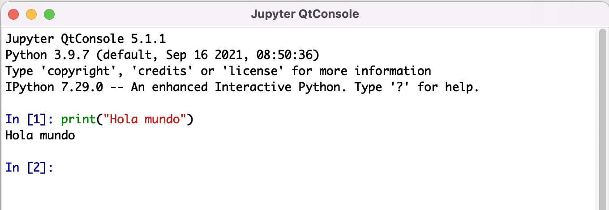

--- 
title: "Python  para estadística"
author: "Mario Alfonso Morales Rivera"
date: "`r Sys.Date()`"
site: bookdown::bookdown_site
documentclass: book
bibliography: [book.bib, packages.bib]
# url: your book url like https://bookdown.org/yihui/bookdown
# cover-image: path to the social sharing image like images/cover.jpg
description: |
  Notas de clase que pronto serán un libro. 
  The HTML output format for this example is bookdown::gitbook,
  set in the _output.yml file.
link-citations: yes
github-repo: rstudio/bookdown-demo

output:
  html_document:
    css: style.css
  pdf_document:
    includes:
      in_header: preamble.tex
---


```{r echo=FALSE}
library(reticulate)
#para ubuntu pc viejo descomentar esta y comentar la de abajo 
#use_condaenv("py38",required = TRUE)
# para mac  descomentar esta y comentar la de arriba   
use_condaenv("/Users/unicordoba/miniforge3/envs/tensorflow",required = TRUE) 
```

```{python echo=FALSE}
import sys 
vers=sys.version[0:6] 
```


# Introducción 

Estimado lector, este documento  corresponde a mis notas de clase del curso **Estadística Básica con Python**, que oriento como docente en el Programa de Estadística, facultad de ciencias Básicas, en la  [Universidad de Córdoba](https://www.unicordoba.edu.co). Como toda creación humana es imperfecta, y este documento no es la excepción, le pido el favor que me ayude a mejorarlo. Puede hacerlo reportando  palabras mal escritas, errores de ortografía (que de seguro abundan), párrafos  que usted considere que son confusos o poco claros, bloques de código que no funcionen como se espera, entre otros. Estaré altamente agradecido con su ayuda y le recompensaré invitándole a un buen café que yo mismo prepararé para usted. Este documento se compiló usando Bookdown [@R-bookdown] y la versión `r py$vers` de Python [@van1995python]. 

## ¿Por qué Python? 

Python se ha convertido en uno de los lenguajes de programación más populares en los últimos años, especialmente para crear sitios web utilizando sus numerosos marcos web, como Django. Python es lo que se denomina un lenguaje de secuencias de comandos, ya que se pueden usar para escribir pequeños programas o secuencias de comandos rápidos. Python se distingue por su gran y activa comunidad de computación científica. La adopción de Python para la computación científica tanto en aplicaciones industriales como en investigación académica ha aumentado significativamente desde principios de la década de 2000 [@McKinney].
Para el análisis de datos, la computación interactiva, exploratoria y la visualización de datos, Python inevitablemente será comparable con muchos otros lenguajes y herramientas de programación comerciales y de código abierto de uso específico en estadística, como R, MATLAB, SAS, Stata y otros. En los últimos años, el soporte de biblioteca mejorado de Python (principalmente pandas) lo ha convertido en una sólida alternativa para las tareas de manipulación de datos. Combinado con la fortaleza de Python en la programación de propósito general, es una excelente opción como lenguaje único para crear aplicaciones centradas en datos. 


## Instalación de Python  

Hay muchas versiones de Python disponibles en Internet para descargar e instalar de forma gratuita. En este libro usamos  [Anaconda](https://www.anaconda.com/products/individual), que agrupa un conjunto de herramientas para trabajar ciencia de datos y aprendizaje automático (Machine Learning) usando Python y R en un computador personal. Anaconda, en su versión individual, desarrollada  para usuarios independientes, es la plataforma preferida para hacer ciencia de datos, con mas de 25 millones de usuarios en todo el mundo.

Anaconda proporciona un repositorio basado en la nube donde puede encontrar e instalar más de 7500 paquetes de ciencia de datos y aprendizaje automático. Con el comando `conda-install`, puede comenzar a usar miles de paquetes de código abierto de Python, R,  Conda, y muchos otros lenguajes.

La edición individual de Anaconda es una solución flexible de código abierto que proporciona las utilidades para crear, distribuir, instalar, actualizar y administrar software de manera multiplataforma. Conda facilita la gestión de múltiples entornos de datos que se pueden mantener y ejecutar por separado sin interferencias entre sí.

__Anaconda Navigator__ es una interfaz gráfica de usuario que viene con la edición individual de Anaconda. Desde __Anaconda Navigator__ es fácil lanzar aplicaciones, manejar paquetes y entornos sin necesidad de usar comandos en la terminal del sistema. Algunas aplicaciones disponibles en esta interfaz gráfica son: 

* [Spyder](https://www.spyder-ide.org):  Un entorno científico gratuito y de código abierto escrito en Python, para Python,  diseñado por y para científicos, ingenieros y analistas de datos.

* [JupyterLab](https://jupyter.org): Es un entorno de desarrollo interactivo basado en la web para __NoteBooks__, código y datos. Permite a los usuarios configurar y organizar trabajos en ciencia de datos, computación científica, reportes  estadísticos y aprendizaje automático.

* [NumPy](https://numpy.org): [@harris2020array]  Es el paquete fundamental y necesario para el análisis de datos y la computación científica de alto rendimiento en Python.
* [Pandas](https://pandas.pydata.org/docs/getting_started/index.html): [@mckinney2010data]    Contiene estructuras de datos de alto nivel y herramientas de manipulación diseñadas para hacer que el análisis de datos sea rápido y fácil en Python. Pandas se basa en NumPy y facilita su uso en aplicaciones centradas en este paquete.  
* [SciPy](https://scipy.org): Es una colección de algoritmos matemáticos y funciones construidas sobre NumPy.  Agrega un poder significativo a Python al proporcionar al usuario comandos y clases de alto nivel para manipular y visualizar datos.
* [Matplotlib](https://matplotlib.org): Matplotlib es una librería  para crear visualizaciones estáticas, animadas e interactivas en Python.
* [Conda](https://docs.conda.io/projects/conda/en/latest/#): Es un sistema de código abierto para la administración de paquetes y entornos que se ejecuta en Windows, macOS y Linux. Con Conda se pueden instalar, ejecutar y actualizar rápidamente los paquetes y sus dependencias. Fue creado para programas de Python, pero puede empaquetar y distribuir software para cualquier otro lenguaje.

Para instalar anaconda vaya a la [página oficial](https://www.anaconda.com/products/individual), y siga las instrucciones para la descarga e instalación que allí se encuentran. En caso de necesitar asesoría adicional para la instalación le recomiendo entrar a [Youtube](https://www.youtube.com/results?search_query=instalar+anaconda+python+2021) y seguir algunos de los tutoriales que enseñan cómo hacer la instalación dependiendo de su sistema operativo. También puede buscar en páginas y blogs que ofrecen tutoriales con las instrucciones de instalación y configuración paso a paso. 

### Ejecución de código Python

Una vez se ha hecho la instalación de Anaconda, los usuarios de Windows y Mac, en el menú de aplicaciones, deben tener el ícono de *Anaconda*, en el cual se da clic para ejecutar  `anaconda-navigator` 


```{r, echo=FALSE}
 
```

luego de cargar `anaconda-navigator` se despliega una ventana donde aparecen, entre otros, los íconos que se muestran en la figura \@ref(fig:IconosAnaconda) desde donde se pueden lanzar las aplicaciones. 

```{r IconosAnaconda,out.width='50%',fig.cap="Anaconda Navigator: Algunas aplicaciones",  echo=FALSE,fig.show ='hold'}
knitr::include_graphics(c("SpyderIcon2.png","JupyterLabIcon2.png"))  
knitr::include_graphics(c("JupyterNotebookIcon2.png","QtConsoleIcon.png"))

```

Se recomienda usar `Notebooks`, cuando además de escribir y ejecutar código se requiere documentarlo, es decir acompañarlo de texto (en formato Markdown), fórmulas matemáticas y ecuaciones, tablas de datos, gráficos, imágenes y en general contenido multimedia. Los `Notebooks` se pueden crear usando  las aplicaciones `JupyterLab` o `Jupyter Notebook`. Si lo que desea es escribir y ejecutar código para resolver una tarea específica, es decir escribir `Scripts`, los cuales se guardan con extensión `.py` se recomienda usar `Spyder` y por último si el interés ejecutar código de manera interactiva, linea por lineas en la consola de Python se recomienda usar `Qt Console`.     

Por último para verificar que Python está funcionando bien en su computadora, lance `QtConsole` y escriba 
```{python}
print("Hola Mundo") 
```
deberá aparece como en la figura \@ref(fig:holamundo) 
```{r holamundo, out.width='95%',  fig.cap="La primera línea de códido de todo programador", echo=FALSE}
 
```


```{r include=FALSE}
# automatically create a bib database for R packages
knitr::write_bib(c(
  .packages(), 'bookdown', 'knitr', 'rmarkdown'
), 'packages.bib')
```

 
